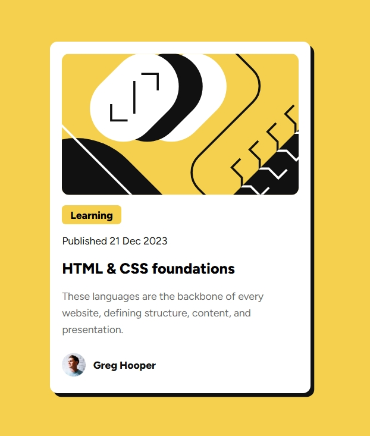

# Frontend Mentor - Blog preview card solution

This is a solution to the [Blog preview card challenge on Frontend Mentor](https://www.frontendmentor.io/challenges/blog-preview-card-ckPaj01IcS). Frontend Mentor challenges help you improve your coding skills by building realistic projects. 

## Table of contents

- [Overview](#overview)
  - [The challenge](#the-challenge)
  - [Screenshot](#screenshot)
  - [Links](#links)
- [My process](#my-process)
  - [Built with](#built-with)
  - [What I learned](#what-i-learned)
  - [AI Collaboration](#ai-collaboration)
- [Author](#author)

## Overview

### The challenge

Users should be able to:

- See hover and focus states for all interactive elements on the page

### Screenshot

### Links

- Solution URL: [GitHub repo](https://github.com/mr-hothead/fem-blog-preview-card)
- Live Site URL: [GitHub hosted page](mr-hothead.github.io/fem-blog-preview-card)

## My process

### Built with

- Semantic HTML5 markup
- CSS custom properties
- Flexbox and order
- Mobile-first workflow

### What I learned

Principles of designing a blog post card, along with using flexbox to set the position of contents of the card and author details. Also learned how to design by referring to Figma designs similar to a professional environment.

### AI Collaboration

**No AI was used in the process of this challenge, either in writing the solution or this markdown**

## Author

- GitHub - [Mr-HotHead](https://github.com/Mr-HotHead)
- Frontend Mentor - [@mr-hothead](https://www.frontendmentor.io/profile/Mr-HotHead)
